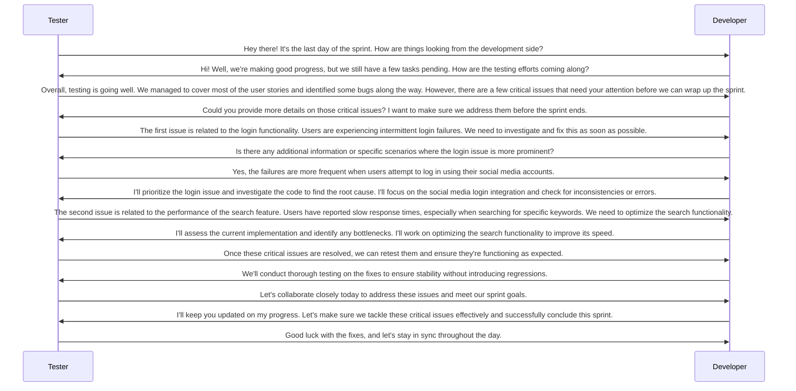

```mermaid
sequenceDiagram
    participant Tester
    participant Developer

    Tester->>Developer: Hey there! It's the last day of the sprint. How are things looking from the development side?
    Developer->>Tester: Hi! Well, we're making good progress, but we still have a few tasks pending. How are the testing efforts coming along?
    Tester->>Developer: Overall, testing is going well. We managed to cover most of the user stories and identified some bugs along the way. However, there are a few critical issues that need your attention before we can wrap up the sprint.
    Developer->>Tester: Could you provide more details on those critical issues? I want to make sure we address them before the sprint ends.
    Tester->>Developer: The first issue is related to the login functionality. Users are experiencing intermittent login failures. We need to investigate and fix this as soon as possible.
    Developer->>Tester: Is there any additional information or specific scenarios where the login issue is more prominent?
    Tester->>Developer: Yes, the failures are more frequent when users attempt to log in using their social media accounts.
    Developer->>Tester: I'll prioritize the login issue and investigate the code to find the root cause. I'll focus on the social media login integration and check for inconsistencies or errors.
    Tester->>Developer: The second issue is related to the performance of the search feature. Users have reported slow response times, especially when searching for specific keywords. We need to optimize the search functionality.
    Developer->>Tester: I'll assess the current implementation and identify any bottlenecks. I'll work on optimizing the search functionality to improve its speed.
    Tester->>Developer: Once these critical issues are resolved, we can retest them and ensure they're functioning as expected.
    Developer->>Tester: We'll conduct thorough testing on the fixes to ensure stability without introducing regressions.
    Tester->>Developer: Let's collaborate closely today to address these issues and meet our sprint goals.
    Developer->>Tester: I'll keep you updated on my progress. Let's make sure we tackle these critical issues effectively and successfully conclude this sprint.
    Tester->>Developer: Good luck with the fixes, and let's stay in sync throughout the day.
```
Note: Said no one ever
