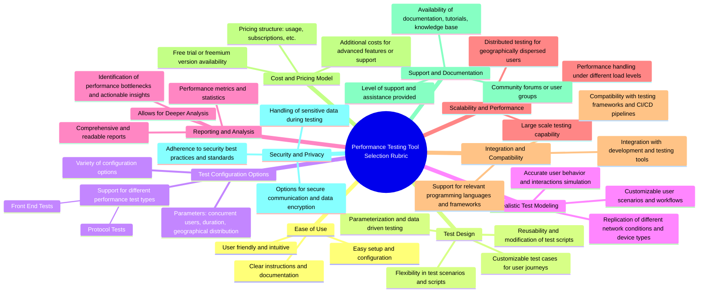

```mermaid
mindmap
  root((Performance Testing Tool Selection Rubric))
    Ease of Use
        User friendly and intuitive
        Easy setup and configuration
        Clear instructions and documentation
    Test Design
        Flexibility in test scenarios and scripts
        Customizable test cases for user journeys
        Parameterization and data driven testing
        Reusability and modification of test scripts
    Test Configuration Options
        Variety of configuration options
        Parameters: concurrent users, duration, geographical distribution
        Support for different performance test types
          Protocol Tests
          Front End Tests
    Realistic Test Modeling
        Accurate user behavior and interactions simulation
        Customizable user scenarios and workflows
        Replication of different network conditions and device types
    Reporting and Analysis
        Performance metrics and statistics
        Comprehensive and readable reports
        Identification of performance bottlenecks and actionable insights
        Allows for Deeper Analysis
    Scalability and Performance
        Large scale testing capability
        Distributed testing for geographically dispersed users
        Performance handling under different load levels
    Integration and Compatibility
        Integration with development and testing tools
        Compatibility with testing frameworks and CI/CD pipelines
        Support for relevant programming languages and frameworks
    Cost and Pricing Model
        Pricing structure: usage, subscriptions, etc.
        Additional costs for advanced features or support
        Free trial or freemium version availability
    Support and Documentation
        Level of support and assistance provided
        Availability of documentation, tutorials, knowledge base
        Community forums or user groups
    Security and Privacy
        Adherence to security best practices and standards
        Handling of sensitive data during testing
        Options for secure communication and data encryption

```
